# Milestone 2: Google Connectors

## Goal

Build the Google connector family on top of the hardened `jido_connect` foundation without turning Google into one oversized provider package. The milestone should prove the connector factory can support a broad, high-value SaaS surface with strict auth, scope, catalog, and normalized data contracts.

The recommended package shape is a shared Google foundation plus focused provider packages:

- `jido_connect_google`
- `jido_connect_google_sheets`
- `jido_connect_gmail`
- `jido_connect_google_drive`
- `jido_connect_google_calendar`

Likely follow-on Google packages after the first Workspace wave:

- `jido_connect_google_contacts`
- `jido_connect_google_meet`
- `jido_connect_google_analytics`
- `jido_connect_google_search_console`

The shared package should own OAuth helpers, Google account/profile normalization, shared transport behavior, scope metadata, error mapping, pagination conventions, webhook/watch helpers where they are genuinely common, and reusable Zoi structs. Product packages should own product-specific DSL specs, handlers, schemas, normalized resource structs, and tests.

## Non-Goals

- Do not build one giant `jido_connect_google_workspace` package in this milestone.
- Do not add Google endpoint logic to `jido_connect` core.
- Do not require host apps to persist credentials, connections, or checkpoints in a package-owned store.
- Do not start with broad Gmail/Drive restricted scopes when narrower scopes can support the workflow.
- Do not adopt generated Google API clients blindly; spike them behind a facade before committing.

## Hex Package Research

| Package | Use | Recommendation | Notes |
| --- | --- | --- | --- |
| [`google_api_sheets`](https://hex.pm/packages/google_api_sheets) | Generated Sheets API client | Spike | Good coverage, but likely needs facade wrapping for Jido errors, scopes, normalization, and tests. |
| [`google_api_gmail`](https://hex.pm/packages/google_api_gmail) | Generated Gmail API client | Spike carefully | Useful for surface discovery, but Gmail scopes and payload privacy need strict boundaries. |
| [`google_api_drive`](https://hex.pm/packages/google_api_drive) | Generated Drive API client | Spike carefully | Drive has broad/restricted scope risks; prefer narrow operations and `drive.file` where possible. |
| [`google_api_calendar`](https://hex.pm/packages/google_api_calendar) | Generated Calendar API client | Spike | Calendar is a good early product connector after Sheets because event/freebusy workflows are common. |
| [`google_api_people`](https://hex.pm/packages/google_api_people) | Generated People/Contacts API client | Later | Useful for contacts, enrichment, Gmail recipients, and Calendar attendee workflows. |
| [`google_api_meet`](https://hex.pm/packages/google_api_meet) | Generated Meet API client | Later | Useful for meeting spaces, conference records, participants, recordings, and transcripts. |
| [`google_api_analytics_data`](https://hex.pm/packages/google_api_analytics_data) | Generated GA4 Analytics Data API client | Later | Belongs in a measurement/marketing track; report schemas need careful normalization. |
| [`google_api_search_console`](https://hex.pm/packages/google_api_search_console) | Generated Search Console API client | Later | Useful for site/search analytics, sitemap management, and URL inspection. |
| [`google_api_pub_sub`](https://hex.pm/packages/google_api_pub_sub) | Pub/Sub API client | Later | Useful for Gmail/Drive push/watch flows if hosts want Google Pub/Sub integration. Not needed for the first action-first pass. |
| [`google_api_oauth2`](https://hex.pm/packages/google_api_oauth2) | Userinfo/tokeninfo APIs | Optional | Useful for account identity verification and profile enrichment. Not the main OAuth flow. |
| [`goth`](https://hex.pm/packages/goth) | Google service account tokens | Later/foundation-compatible | Best for service-account and server-to-server auth. Keep OAuth user auth first, then add service accounts/domain delegation deliberately. |
| [`oauth2`](https://hex.pm/packages/oauth2) | Generic OAuth 2.0 client | Candidate | Fits reusable OAuth exchange/refresh helpers if current internal OAuth helpers need a dependency. |
| [`assent`](https://hex.pm/packages/assent) | OAuth/OIDC strategies | Optional host-facing spike | Useful in Phoenix auth flows, but may be too host-app oriented for connector runtime. |
| [`ueberauth_google`](https://hex.pm/packages/ueberauth_google) | Phoenix authentication strategy | Host-app concern | Good for sign-in, less useful as a connector package runtime dependency. |

Current package stance:

- Treat generated `google_api_*` clients as implementation candidates, not as the public connector API.
- Keep public facades and handler contracts in Jido packages stable even if the underlying client choice changes.
- Prefer the existing `Jido.Connect.Provider.Transport` style unless a generated client clearly reduces risk.
- Preserve sanitized provider errors and normalized resource structs regardless of client backend.

## Auth And Scope Strategy

Google should support multiple auth profiles over time, but Milestone 2 should start narrowly.

### Auth Profiles

- `:user` OAuth profile first.
- `:service_account` profile later for server-owned workflows.
- `:domain_delegated_service_account` later for Workspace admin/domain delegation.

The shared `jido_connect_google` package should model these as first-class auth alternatives so product operations can declare exactly what they support.

### Scope Rules

Use dynamic scope resolution aggressively. Google scopes are workflow-dependent, especially for Drive and Gmail.

Reference docs:

- [Sheets API scopes](https://developers.google.com/workspace/sheets/api/scopes)
- [Gmail API scopes](https://developers.google.com/workspace/gmail/api/auth/scopes)
- [Drive API scopes](https://developers.google.com/workspace/drive/api/guides/api-specific-auth)
- [Calendar API scopes](https://developers.google.com/workspace/calendar/api/auth)

Initial scope posture:

- Sheets: prefer spreadsheet-level scopes for sheet operations; use Drive scopes only when file discovery/creation requires them.
- Gmail: split send/draft/label/metadata/read/modify workflows so hosts can avoid restricted scopes until they explicitly need them.
- Drive: prefer `drive.file` and metadata scopes before broad Drive scopes.
- Calendar: start with freebusy and event CRUD scopes, split readonly and write operations.

## Build Waves

### Wave 2.0: Shared Google Foundation

Package: `jido_connect_google`

Deliverables:

- Google OAuth profile and connection metadata normalization.
- Token refresh helper compatible with `CredentialLease`.
- Google account/userinfo normalization.
- Shared Google transport helper or generated-client facade boundary.
- Google error mapping into Splode/Jido errors with sanitized details.
- Scope catalog and dynamic scope resolver helpers.
- Shared pagination helpers for page tokens.
- Shared webhook/watch primitives only if they are reusable across Gmail/Drive/Calendar.
- README with Phoenix host integration notes.

Acceptance:

- A product connector can depend on `jido_connect_google` without pulling Slack/GitHub code.
- A host can create a user OAuth connection and mint a short-lived lease.
- Shared helpers are storage-free and testable without live Google credentials.

### Wave 2.1: Google Sheets

Package: `jido_connect_google_sheets`

Start here because Sheets gives high value with manageable auth and a clear action-first surface.

Initial actions:

- `google.sheets.spreadsheet.get`
- `google.sheets.spreadsheet.create`
- `google.sheets.values.get`
- `google.sheets.values.update`
- `google.sheets.values.append`
- `google.sheets.values.clear`
- `google.sheets.sheet.add`
- `google.sheets.sheet.delete`
- `google.sheets.sheet.rename`
- `google.sheets.batch_update`

Normalized structs:

- `Google.Sheets.Spreadsheet`
- `Google.Sheets.Sheet`
- `Google.Sheets.Range`
- `Google.Sheets.ValueRange`
- `Google.Sheets.UpdateResult`

Catalog packs:

- `google_sheets_readonly`
- `google_sheets_writer`

### Wave 2.2: Gmail

Package: `jido_connect_gmail`

Gmail needs careful scope and privacy handling. Keep read and write surfaces separated.

Initial actions:

- `google.gmail.profile.get`
- `google.gmail.message.list`
- `google.gmail.message.get_metadata`
- `google.gmail.message.send`
- `google.gmail.draft.create`
- `google.gmail.draft.send`
- `google.gmail.label.list`
- `google.gmail.label.create`
- `google.gmail.label.apply`
- `google.gmail.thread.list`
- `google.gmail.thread.get_metadata`

Initial triggers:

- `google.gmail.message.received` as a poll trigger first.
- Push/watch support later after Pub/Sub ownership is clear.

Normalized structs:

- `Google.Gmail.Profile`
- `Google.Gmail.Message`
- `Google.Gmail.Thread`
- `Google.Gmail.Label`
- `Google.Gmail.Draft`

Catalog packs:

- `google_gmail_send`
- `google_gmail_triage`
- `google_gmail_metadata`

### Wave 2.3: Google Drive

Package: `jido_connect_google_drive`

Drive is scope-sensitive and should prefer file-scoped access.

Initial actions:

- `google.drive.file.list`
- `google.drive.file.get_metadata`
- `google.drive.file.create`
- `google.drive.file.copy`
- `google.drive.file.update_metadata`
- `google.drive.file.delete`
- `google.drive.file.export`
- `google.drive.permission.list`
- `google.drive.permission.create`
- `google.drive.folder.create`

Initial triggers:

- `google.drive.file.changed` as a poll trigger first.
- Watch channel support later after lifecycle persistence is designed.

Normalized structs:

- `Google.Drive.File`
- `Google.Drive.Permission`
- `Google.Drive.Folder`
- `Google.Drive.Change`

Catalog packs:

- `google_drive_readonly`
- `google_drive_file_writer`

### Wave 2.4: Google Calendar

Package: `jido_connect_google_calendar`

Calendar should be a small, ergonomic connector with strong schemas.

Initial actions:

- `google.calendar.calendar.list`
- `google.calendar.event.list`
- `google.calendar.event.get`
- `google.calendar.event.create`
- `google.calendar.event.update`
- `google.calendar.event.delete`
- `google.calendar.freebusy.query`
- `google.calendar.availability.find`

Initial triggers:

- `google.calendar.event.changed` as a poll trigger first.
- Push/watch support later after channel renewal persistence is planned.

Normalized structs:

- `Google.Calendar.Calendar`
- `Google.Calendar.Event`
- `Google.Calendar.Attendee`
- `Google.Calendar.FreeBusy`

Catalog packs:

- `google_calendar_reader`
- `google_calendar_scheduler`

### Wave 2.5: Google Contacts

Package: `jido_connect_google_contacts`

Backed by the People API. This should be a follow-on package because it is useful across Gmail, Calendar, and CRM-style workflows, but it is not required to prove the first Google connector foundation.

Initial actions:

- `google.contacts.person.list`
- `google.contacts.person.get`
- `google.contacts.person.search`
- `google.contacts.contact.create`
- `google.contacts.contact.update`
- `google.contacts.contact.delete`
- `google.contacts.contact_group.list`
- `google.contacts.contact_group.create`
- `google.contacts.contact_group.update`

Normalized structs:

- `Google.Contacts.Person`
- `Google.Contacts.ContactGroup`
- `Google.Contacts.EmailAddress`
- `Google.Contacts.PhoneNumber`
- `Google.Contacts.Organization`

Catalog packs:

- `google_contacts_readonly`
- `google_contacts_manager`

### Wave 2.6: Google Meet

Package: `jido_connect_google_meet`

Meet should be tied closely to Calendar and Workspace Events. Start action-first, then add event subscriptions once the shared watch/subscription lifecycle is designed.

Initial actions:

- `google.meet.space.create`
- `google.meet.space.get`
- `google.meet.conference_record.list`
- `google.meet.conference_record.get`
- `google.meet.participant.list`
- `google.meet.recording.list`
- `google.meet.transcript.list`

Initial triggers:

- `google.meet.conference.started` through Workspace Events later.
- `google.meet.recording.generated` through Workspace Events later.
- `google.meet.transcript.generated` through Workspace Events later.

Normalized structs:

- `Google.Meet.Space`
- `Google.Meet.ConferenceRecord`
- `Google.Meet.Participant`
- `Google.Meet.Recording`
- `Google.Meet.Transcript`

Catalog packs:

- `google_meet_reader`
- `google_meet_scheduler`

### Wave 2.7: Google Analytics

Package: `jido_connect_google_analytics`

Analytics should be treated as a measurement connector, not a Workspace connector. Start with GA4 reporting through the Analytics Data API. Admin/property management can be a later expansion.

Initial actions:

- `google.analytics.report.run`
- `google.analytics.report.batch_run`
- `google.analytics.realtime.run`
- `google.analytics.metadata.get`
- `google.analytics.property.summary.list`

Normalized structs:

- `Google.Analytics.Report`
- `Google.Analytics.Row`
- `Google.Analytics.Dimension`
- `Google.Analytics.Metric`
- `Google.Analytics.PropertySummary`

Catalog packs:

- `google_analytics_reader`
- `google_analytics_reporter`

### Wave 2.8: Google Search Console

Package: `jido_connect_google_search_console`

Search Console belongs near Analytics because both feed marketing, SEO, and reporting workflows. It should stay separate from Analytics because auth, resources, and normalized outputs are different.

Initial actions:

- `google.search_console.site.list`
- `google.search_console.site.add`
- `google.search_console.search_analytics.query`
- `google.search_console.sitemap.list`
- `google.search_console.sitemap.submit`
- `google.search_console.url.inspect`

Normalized structs:

- `Google.SearchConsole.Site`
- `Google.SearchConsole.SearchAnalyticsReport`
- `Google.SearchConsole.SearchAnalyticsRow`
- `Google.SearchConsole.Sitemap`
- `Google.SearchConsole.UrlInspectionResult`

Catalog packs:

- `google_search_console_reader`
- `google_search_console_seo`

### Wave 2.9: Cross-Google Hardening

Deliverables:

- Shared fixtures and golden HTTP tests.
- Scope-minimization tests for each operation.
- Catalog search and pack examples across Google products.
- Demo Phoenix OAuth flow for Google.
- Optional generated-client ADR.
- Optional service-account/domain-delegation ADR.
- Push/watch persistence design for Gmail, Drive, Calendar, and Meet.

## Generated Client Spike

Before implementing many endpoints by hand, create a spike comparing two approaches for each product:

- Generated `google_api_*` client behind a Jido facade.
- Handwritten small Req clients using shared Google transport.

Evaluate:

- Test ergonomics.
- Error normalization.
- Sanitized failure details.
- Request shape visibility.
- Scope and auth profile control.
- Dependency size and transitive dependencies.
- Long-term maintainability for 100+ connectors.

The production connector API should remain the same regardless of the chosen backend.

## First Beadwork Epics

Create epics in this order:

- `Milestone 2: Google connector family`
- `Google foundation: OAuth, transport, scopes, and account identity`
- `Google generated-client spike`
- `Google Sheets connector`
- `Gmail connector`
- `Google Drive connector`
- `Google Calendar connector`
- `Google Contacts connector`
- `Google Meet connector`
- `Google Analytics connector`
- `Google Search Console connector`
- `Google cross-product hardening and demo`

Suggested first task set:

- Scaffold `jido_connect_google`.
- Add Google OAuth profile and account metadata structs.
- Add Google token refresh helper.
- Add Google scope catalog and dynamic resolver helpers.
- Spike `google_api_sheets` behind a facade.
- Implement Sheets read-only actions.
- Add Sheets writer actions.
- Add catalog packs for Sheets.
- Write the Google host integration README.

## Beadwork Backlog Plan

Use this section as the source of truth when loading Milestone 2 into Beadwork. Each epic and story has a stable planning ID so dependencies can be preserved even if Beadwork assigns different issue IDs.

### Current Status

| Planning ID | Beadwork epic | Status |
| --- | --- | --- |
| G00 | `[G00] Milestone Orchestration` | Closed after importing epics, tasks, labels, and dependencies. |
| G01 | `[G01] Shared Google Foundation` | Closed after adding the initial shared Google package, auth metadata, OAuth refresh, transport, scopes, pagination, tests, and README. |
| G02 | `[G02] Generated-Client Spike` | In progress. |
| G03 | `[G03] Google Sheets Connector` | Blocked by G01 and G02. |
| G04 | `[G04] Gmail Connector` | Blocked by Sheets proving the package pattern. |
| G05 | `[G05] Google Drive Connector` | Blocked by Sheets proving the package pattern. |
| G06 | `[G06] Google Calendar Connector` | Blocked by Sheets proving the package pattern. |
| G07 | `[G07] Google Contacts Connector` | Blocked by Gmail and Calendar. |
| G08 | `[G08] Google Meet Connector` | Blocked by Calendar. |
| G09 | `[G09] Google Analytics Connector` | Blocked by Sheets proving the package pattern. |
| G10 | `[G10] Google Search Console Connector` | Blocked by Analytics. |
| G11 | `[G11] Cross-Google Hardening And Demo` | Blocked by product connector waves. |

Suggested Beadwork mapping:

- Create one Beadwork epic per `Gxx` section.
- Create one Beadwork story per `Gxx-Syy` row.
- Put the planning ID at the start of each issue title, for example `[G01-S01] Scaffold shared Google package`.
- Translate `Depends on` into Beadwork blocking relationships.
- Keep implementation issues small enough that the Beadwork Codex loop can finish one story, format, test, and commit cleanly.

### Global Execution Graph

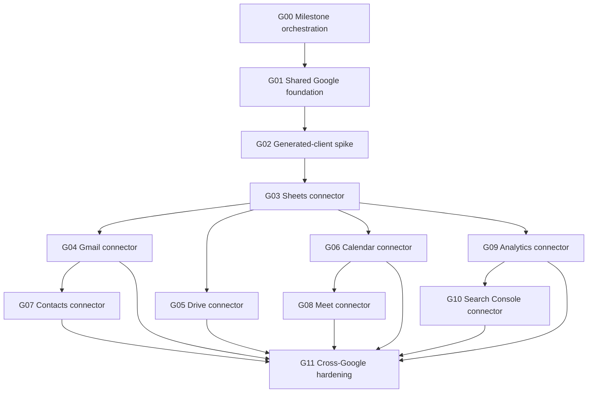

### G00: Milestone Orchestration

Purpose: keep the milestone coherent while implementation happens in many small issues.

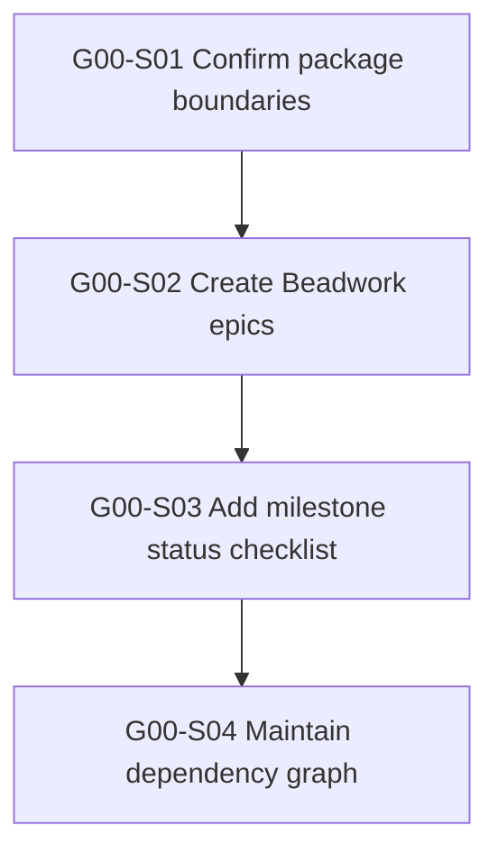

| ID | Story | Depends on | Acceptance |
| --- | --- | --- | --- |
| G00-S01 | Confirm Google package boundaries | None | Final package list is documented; first-wave and later-wave packages are explicitly separated. |
| G00-S02 | Create Beadwork epics from this plan | G00-S01 | Beadwork has epics for G01 through G11 with dependency edges. |
| G00-S03 | Add milestone status checklist | G00-S02 | `MILESTONE_2.md` or a linked status doc tracks each package wave and verification result. |
| G00-S04 | Maintain dependency graph as work lands | G00-S03 | Graph stays accurate after each package wave; completed stories are not left ambiguous. |

### G01: Shared Google Foundation

Purpose: create the reusable package that every Google product connector depends on.

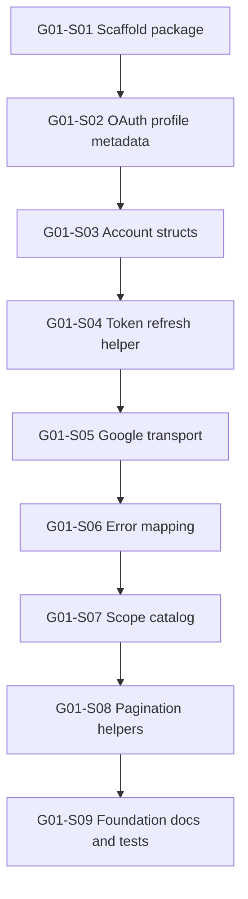

| ID | Story | Depends on | Acceptance |
| --- | --- | --- | --- |
| G01-S01 | Scaffold `jido_connect_google` | G00-S01 | Umbrella app exists, compiles, has README, tests, formatter config, and no empty supervisor unless needed. |
| G01-S02 | Add Google auth profiles | G01-S01 | `:user`, `:service_account`, and `:domain_delegated_service_account` are modeled without forcing service account implementation. |
| G01-S03 | Add Google account/profile structs | G01-S02 | Zoi structs normalize account id, email, display name, hosted domain, avatar URL, and raw provider metadata boundaries. |
| G01-S04 | Add token refresh helper | G01-S02 | Helper can refresh user OAuth tokens and return lease-ready credential material without storing it. |
| G01-S05 | Add Google transport/facade boundary | G01-S01 | Common Google headers, base URL handling, Req options, and generated-client boundary are testable. |
| G01-S06 | Add Google error mapping | G01-S05 | Google HTTP/API errors map to sanitized `Jido.Connect.Error` values with no raw response leakage. |
| G01-S07 | Add shared scope catalog helpers | G01-S02 | Product packages can declare static and dynamic Google scopes consistently. |
| G01-S08 | Add page-token pagination helpers | G01-S05 | List APIs can share page token request/response normalization. |
| G01-S09 | Add foundation README and host guide | G01-S04, G01-S06, G01-S07 | Host docs show OAuth, refresh, connection creation, lease minting, and provider package usage. |

### G02: Generated-Client Spike

Purpose: decide whether generated `google_api_*` packages should be runtime dependencies, implementation references, or avoided for hand-written clients.

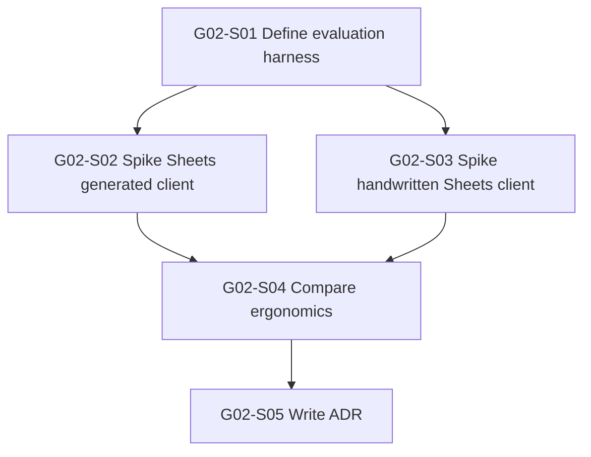

| ID | Story | Depends on | Acceptance |
| --- | --- | --- | --- |
| G02-S01 | Define generated-client evaluation harness | G01-S05 | Spike criteria cover auth, Req/Tesla friction, tests, error mapping, normalized structs, and dependency weight. |
| G02-S02 | Spike `google_api_sheets` behind facade | G02-S01 | One read operation works through a Jido facade with sanitized errors and test fixtures. |
| G02-S03 | Spike handwritten Sheets Req client | G02-S01 | Same operation works through shared Google transport with equivalent normalized output. |
| G02-S04 | Compare generated vs handwritten clients | G02-S02, G02-S03 | Tradeoffs are documented using actual implementation evidence. |
| G02-S05 | Write generated-client ADR | G02-S04 | ADR recommends runtime dependency, dev/reference-only usage, or handwritten clients for first wave. |

### G03: Google Sheets Connector

Purpose: prove the Google foundation with a useful, relatively low-risk action-first product connector.

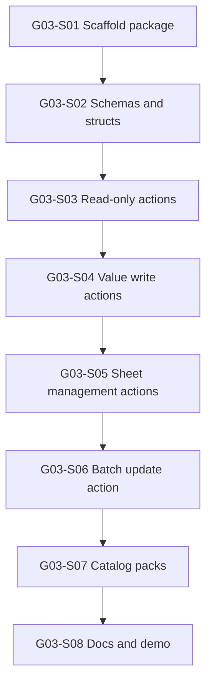

| ID | Story | Depends on | Acceptance |
| --- | --- | --- | --- |
| G03-S01 | Scaffold `jido_connect_google_sheets` | G01-S09, G02-S05 | Package compiles and depends on `jido_connect_google` only for shared Google behavior. |
| G03-S02 | Add Sheets normalized structs and schemas | G03-S01 | Spreadsheet, sheet, range, value range, and update result structs validate with Zoi. |
| G03-S03 | Implement Sheets read-only actions | G03-S02 | `spreadsheet.get` and `values.get` execute through `Jido.Connect.invoke/4` with scope checks. |
| G03-S04 | Implement Sheets value write actions | G03-S03 | `values.update`, `values.append`, and `values.clear` support dynamic scopes and normalized results. |
| G03-S05 | Implement sheet management actions | G03-S04 | `sheet.add`, `sheet.delete`, and `sheet.rename` are covered by unit and generated-action tests. |
| G03-S06 | Implement `google.sheets.batch_update` | G03-S05 | Batch operation has strict input validation and confirmation/risk metadata if needed. |
| G03-S07 | Add Sheets catalog packs | G03-S06 | `google_sheets_readonly` and `google_sheets_writer` restrict search/describe/call correctly. |
| G03-S08 | Add Sheets README and demo snippets | G03-S07 | Docs show dependency setup, OAuth scopes, catalog search, describe, and call examples. |

### G04: Gmail Connector

Purpose: add high-value email automation with strict scope separation and privacy boundaries.

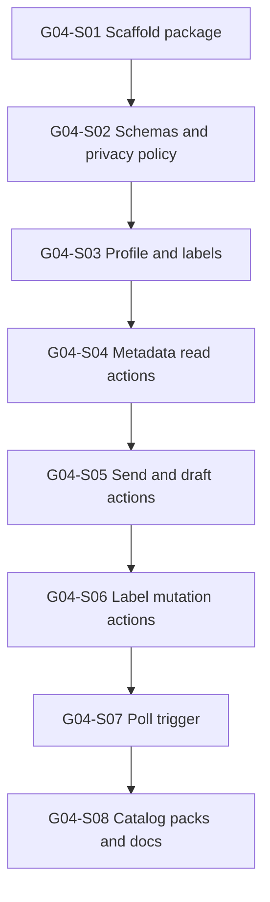

| ID | Story | Depends on | Acceptance |
| --- | --- | --- | --- |
| G04-S01 | Scaffold `jido_connect_gmail` | G03-S08 | Package compiles and uses shared Google foundation. |
| G04-S02 | Add Gmail schemas and privacy boundaries | G04-S01 | Message/thread/label/draft structs avoid raw body leakage by default and document sensitive fields. |
| G04-S03 | Implement profile and label list actions | G04-S02 | `profile.get` and `label.list` work with narrow scopes. |
| G04-S04 | Implement metadata-only message/thread reads | G04-S03 | List/get metadata actions avoid full message body scopes unless explicitly added later. |
| G04-S05 | Implement send and draft actions | G04-S04 | Send/draft actions validate recipients, body inputs, and dynamic scopes. |
| G04-S06 | Implement label create/apply actions | G04-S05 | Label mutations have focused tests and normalized outputs. |
| G04-S07 | Add `google.gmail.message.received` poll trigger | G04-S04 | Poll trigger updates checkpoint and does not emit duplicate signals across ticks. |
| G04-S08 | Add Gmail catalog packs and docs | G04-S07 | Send, triage, and metadata packs expose only intended tools. |

### G05: Google Drive Connector

Purpose: add file and folder workflows while minimizing broad Drive scopes.

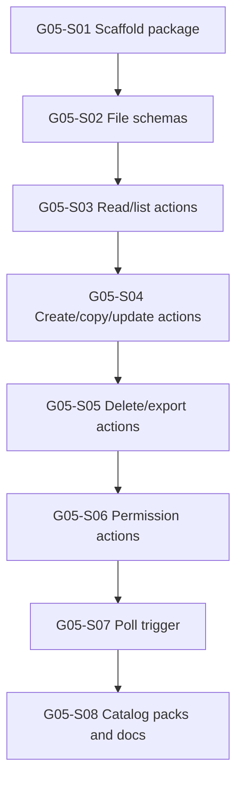

| ID | Story | Depends on | Acceptance |
| --- | --- | --- | --- |
| G05-S01 | Scaffold `jido_connect_google_drive` | G03-S08 | Package compiles and uses shared Google foundation. |
| G05-S02 | Add Drive normalized structs and schemas | G05-S01 | File, folder, permission, and change structs validate with Zoi. |
| G05-S03 | Implement file list and metadata actions | G05-S02 | Read actions prefer narrow metadata/file scopes. |
| G05-S04 | Implement file create/copy/update actions | G05-S03 | Mutations support `drive.file` where possible and normalized outputs. |
| G05-S05 | Implement file delete/export actions | G05-S04 | Destructive operations include risk/confirmation metadata. |
| G05-S06 | Implement permission list/create actions | G05-S05 | Permission changes validate role/type inputs and expose risk. |
| G05-S07 | Add `google.drive.file.changed` poll trigger | G05-S03 | Poll trigger uses checkpoint continuity and normalized change signals. |
| G05-S08 | Add Drive catalog packs and docs | G05-S07 | Readonly and file-writer packs restrict broad actions. |

### G06: Google Calendar Connector

Purpose: add scheduling workflows with clean event schemas and practical availability helpers.

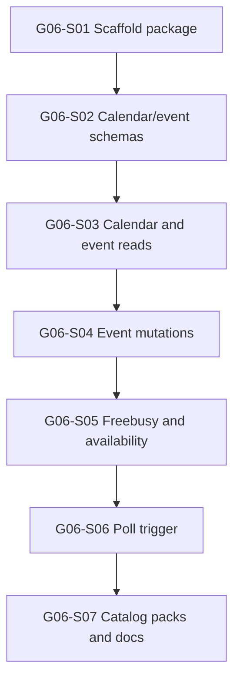

| ID | Story | Depends on | Acceptance |
| --- | --- | --- | --- |
| G06-S01 | Scaffold `jido_connect_google_calendar` | G03-S08 | Package compiles and uses shared Google foundation. |
| G06-S02 | Add Calendar normalized structs and schemas | G06-S01 | Calendar, event, attendee, and freebusy structs validate with Zoi. |
| G06-S03 | Implement calendar and event read actions | G06-S02 | `calendar.list`, `event.list`, and `event.get` work with readonly scopes. |
| G06-S04 | Implement event create/update/delete actions | G06-S03 | Event mutations validate times, attendees, recurrence, and dynamic scopes. |
| G06-S05 | Implement freebusy and availability actions | G06-S04 | Availability helper returns normalized candidate windows. |
| G06-S06 | Add `google.calendar.event.changed` poll trigger | G06-S03 | Poll trigger emits normalized event-change signals and maintains checkpoint. |
| G06-S07 | Add Calendar catalog packs and docs | G06-S06 | Reader and scheduler packs expose the right operations. |

### G07: Google Contacts Connector

Purpose: add People API-backed contacts for enrichment and cross-product workflows.

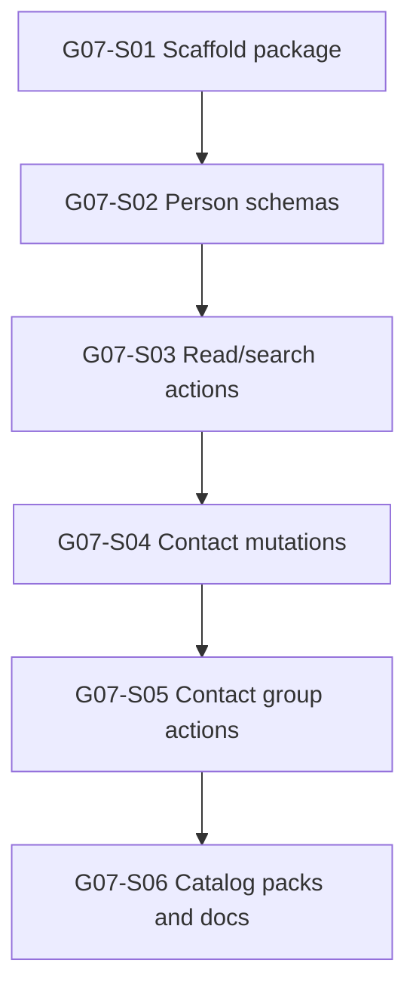

| ID | Story | Depends on | Acceptance |
| --- | --- | --- | --- |
| G07-S01 | Scaffold `jido_connect_google_contacts` | G04-S08, G06-S07 | Package compiles and shares account/scope helpers with Gmail and Calendar. |
| G07-S02 | Add People/Contacts normalized structs | G07-S01 | Person, group, email, phone, and organization structs validate with Zoi. |
| G07-S03 | Implement person list/get/search actions | G07-S02 | Read/search actions support narrow contacts/profile scopes. |
| G07-S04 | Implement contact create/update/delete actions | G07-S03 | Mutations validate names, emails, phones, organizations, and risk metadata. |
| G07-S05 | Implement contact group actions | G07-S04 | Group list/create/update actions have focused tests. |
| G07-S06 | Add Contacts catalog packs and docs | G07-S05 | Readonly and manager packs restrict mutation tools correctly. |

### G08: Google Meet Connector

Purpose: add meeting-space and conference-record workflows, then prepare for Workspace Events-backed triggers.

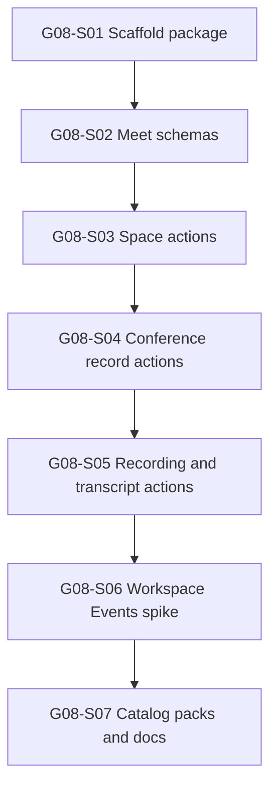

| ID | Story | Depends on | Acceptance |
| --- | --- | --- | --- |
| G08-S01 | Scaffold `jido_connect_google_meet` | G06-S07 | Package compiles and aligns with Calendar scheduling workflows. |
| G08-S02 | Add Meet normalized structs | G08-S01 | Space, conference record, participant, recording, and transcript structs validate with Zoi. |
| G08-S03 | Implement meeting space actions | G08-S02 | `space.create` and `space.get` work with appropriate scopes. |
| G08-S04 | Implement conference record actions | G08-S03 | Conference record list/get actions return normalized records. |
| G08-S05 | Implement recording/transcript list actions | G08-S04 | Recording and transcript metadata actions avoid fetching sensitive content by default. |
| G08-S06 | Spike Workspace Events for Meet triggers | G08-S05 | Event subscription design is documented without adding durable persistence yet. |
| G08-S07 | Add Meet catalog packs and docs | G08-S06 | Reader and scheduler packs expose action-first surface and mark triggers as later. |

### G09: Google Analytics Connector

Purpose: add GA4 reporting for marketing and product analytics workflows.

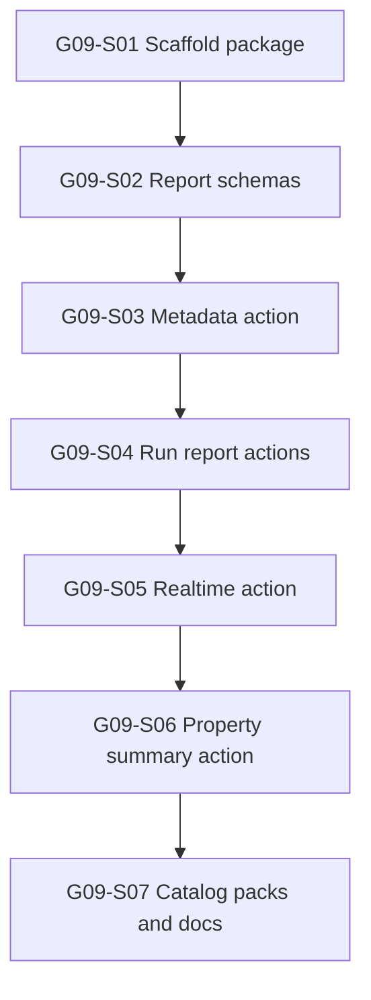

| ID | Story | Depends on | Acceptance |
| --- | --- | --- | --- |
| G09-S01 | Scaffold `jido_connect_google_analytics` | G03-S08 | Package compiles and uses shared Google auth/transport. |
| G09-S02 | Add Analytics normalized report structs | G09-S01 | Report, row, dimension, metric, and property summary structs validate with Zoi. |
| G09-S03 | Implement metadata action | G09-S02 | Metadata action exposes available dimensions/metrics for a property. |
| G09-S04 | Implement run report and batch report actions | G09-S03 | Report actions validate date ranges, dimensions, metrics, filters, and limits. |
| G09-S05 | Implement realtime report action | G09-S04 | Realtime action has separate schemas and scope checks. |
| G09-S06 | Implement property summary list action | G09-S05 | Property discovery returns normalized summaries. |
| G09-S07 | Add Analytics catalog packs and docs | G09-S06 | Reader and reporter packs are searchable/describable/callable through catalog plugin. |

### G10: Google Search Console Connector

Purpose: add SEO/search reporting workflows that pair naturally with Analytics.

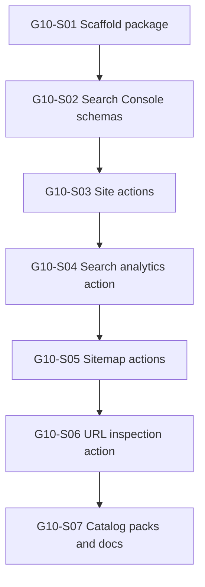

| ID | Story | Depends on | Acceptance |
| --- | --- | --- | --- |
| G10-S01 | Scaffold `jido_connect_google_search_console` | G09-S07 | Package compiles and can share report/date-range patterns with Analytics. |
| G10-S02 | Add Search Console normalized structs | G10-S01 | Site, search report, row, sitemap, and URL inspection structs validate with Zoi. |
| G10-S03 | Implement site list/add actions | G10-S02 | Site actions validate URL/property inputs and scopes. |
| G10-S04 | Implement search analytics query action | G10-S03 | Query action validates date range, dimensions, filters, search type, and row limits. |
| G10-S05 | Implement sitemap list/submit actions | G10-S04 | Sitemap actions normalize sitemap metadata and submission result. |
| G10-S06 | Implement URL inspection action | G10-S05 | URL inspection returns sanitized, normalized inspection results. |
| G10-S07 | Add Search Console catalog packs and docs | G10-S06 | Reader and SEO packs restrict write/admin actions correctly. |

### G11: Cross-Google Hardening And Demo

Purpose: make the Google family feel coherent, safe, and shippable after the first product waves.

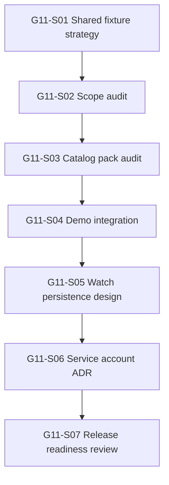

| ID | Story | Depends on | Acceptance |
| --- | --- | --- | --- |
| G11-S01 | Consolidate shared Google fixtures | G03-S08, G04-S08, G05-S08, G06-S07 | Shared fixture helpers reduce duplicated fake Google responses without hiding request shape. |
| G11-S02 | Run cross-product scope audit | G04-S08, G05-S08, G06-S07, G07-S06, G08-S07, G09-S07, G10-S07 | Every action has static or dynamic scopes documented and tested. |
| G11-S03 | Audit catalog packs across Google products | G11-S02 | Packs restrict search/describe/call and avoid accidental broad-risk tool exposure. |
| G11-S04 | Add Google demo integration | G11-S03 | Demo shows OAuth, connection resolver, catalog search, describe, and call for at least Sheets, Gmail, Drive, and Calendar. |
| G11-S05 | Write watch/checkpoint persistence design | G11-S04 | Gmail, Drive, Calendar, and Meet watch requirements are captured for a later persistence milestone. |
| G11-S06 | Write service account/domain delegation ADR | G11-S05 | ADR defines what belongs in package contracts versus host-owned configuration/storage. |
| G11-S07 | Run release readiness review | G11-S06 | Quality commands pass and remaining risks are tracked as explicit follow-up issues. |

## Verification

Use the existing quality bar after each package wave:

```sh
mix format --check-formatted
mix compile --warnings-as-errors
mix test
mix quality
cd dev/demo && mix format --check-formatted && mix clean && mix compile --warnings-as-errors && mix test
```

Provider packages should also include focused tests for:

- Dynamic scopes.
- Lease expiration and connection mismatch paths.
- Provider HTTP error sanitization.
- Catalog search, describe, and call behavior.
- Normalized Zoi structs.
- Generated Jido actions/sensors.

## Open Questions

- Should the generated Google API packages be runtime dependencies, dev/test references, or only research aids?
- Should `jido_connect_google` expose a generic Google token refresh helper or only auth-profile metadata and leave refresh to hosts?
- How much service-account support belongs in Milestone 2 versus a later admin/workspace milestone?
- What is the durable persistence contract for Google watch channels and poll checkpoints?
- Should Google product packages live under `jido_connect_google_*` names consistently, or should high-brand products use shorter names like `jido_connect_gmail`?
